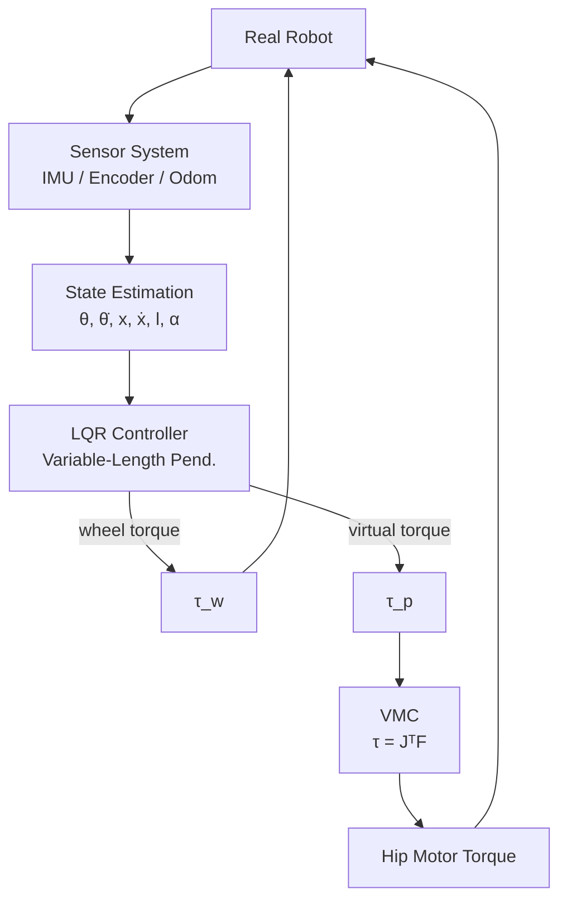

# 概论

轮腿构型机器人在赛场上因为构型原因，通常有更好的移动速度上限和地形跨越能力。纵观赛场历史，曾经出现过多种构型：**两轮构型**，**开链四连杆构型**，**并联构型**，**偏置并联构型**（也叫串联腿）。

## 系统概述

控制方面，机器人控制其实就是“**抽象 → 建模 → 简化 → 求解 → 映射**”的过程。通过物理层的抽象，此类机器人的本质都是轮式倒立摆结构。

控制系统大致可以概括为以下层级

## 约定

在腿式机器人的研发过程中，最容易出现错误的是正方向的约定与统一，如果出现某一个符号错误很有可能出现无法平衡，甚至能够平衡但是姿态很奇怪的情况（你猜我怎么知道的），所以我们应该对所有力的正方向进行统一，保证正确性。

| **Tip** · 符号说明 |
| :-- |

1. 统一左视图
2. VMC符号约定：左视图朝左为 $`x`$ 轴正方向，朝下为 $`y`$ 轴正方向
3. 物理建模符号约定：遵循前 $`x`$ ，左 $`y`$ ，上 $`z`$ 的方向约定，即左视图逆时针为旋转相关量的正方向，向上为力的正方向
