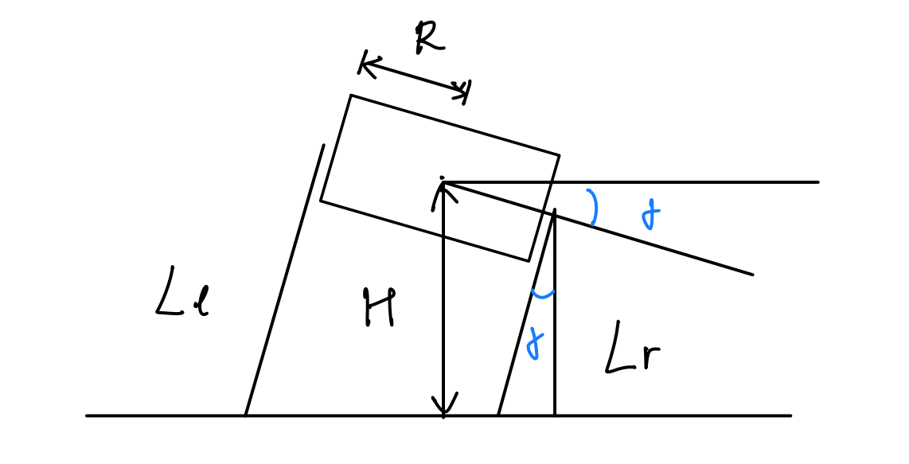
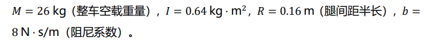

# 腿长与 Roll 动力学建模

本章建立双轮接地时的车身升降与 Roll 简化模型。左右腿的共同伸缩用于调节车身高度，差动伸缩用于调节 Roll；支撑力经 [VMC](04_vmc.md) 映射到关节力矩。

## 建模假设与符号约定

| 符号 | 含义与正方向 |
|------|------|
| $F_{s,l}$、$F_{s,r}$ | 左、右腿对机身的轴向支撑力，沿腿轴指向机身为正；下标$s$ = support force。 |
| $F_{l,l}$、$F_{l,r}$ | 左、右腿对机身的作用力，向上为正 |
| $F_{N,l}$、$F_{N,r}$ |地面对轮子的法向力|

仅考虑轴向传力，且腿轴与世界竖直方向夹角为 $\gamma$ (roll为$\gamma$）时，$F^v_{l,i}=F_{s,i}\cos\gamma$（$i=l,r$)

约定：

- 双轮始终与同一水平地面接触。
- IMU 的安装方向为 +x 轴朝前，右手坐标系。车身绕 +x 轴的 Roll 角为 $\gamma$，左腿高、右腿低时为正。
- $H$ 为髋轴中点的离地高度，向上为正；简化模型中近似作为机身质心高度，计算时使用
```math
H \approx R_{wheel} + \frac{1}{2}\cos\gamma(L_l\cos\alpha_l +L_r\cos\alpha_r)
```
- 其中$\alpha_l,\alpha_r$为左右腿倾角
- $M$ 为整车质量，$I_{roll}$ 为绕质心 Roll 轴的转动惯量，$R$ 为半轮距（对应前文的 $R_b$），$b$ 为竖直方向的等效阻尼系数。目前都视为常数


## 腿长与车身姿态

在水平姿态、两腿近似竖直时，直接取竖直投影高度 $h_i\approx l_i$。$R_h$ 为半髋距，可近似取半轮距 $R$；$R_w$ 为轮半径。

```math
H\approx R_w+\frac{l_l+l_r}{2},\qquad
\gamma\approx\frac{l_l-l_r}{2R_h}.
```

相对于平衡点的小变化为：

```math
\delta H\approx\frac{\delta l_l+\delta l_r}{2},\qquad
\delta\gamma\approx\frac{\delta l_l-\delta l_r}{2R_h}.
```

>TODO: 暂时认为腿角不能小角度近似，现在没有使用


两腿共同伸长会抬高机身，左腿伸长、右腿缩短会产生正 Roll。目标腿长直接取：

```math
l_{l,ref}\approx H_{ref}-R_w+R_h\gamma_{ref},\qquad
l_{r,ref}\approx H_{ref}-R_w-R_h\gamma_{ref}.
```

## 动力学建模

### 竖直方向的平动

左右等效支撑力的竖直分量之和抵消重力，并驱动车身升降：

```math
M\ddot H=(F_{s,l}+F_{s,r})\cos\gamma-b\dot H-Mg.
```

### 绕 Roll 轴的转动

采用等效力臂 $R$，左右支撑力之差产生 Roll 力矩：

```math
I_{roll}\ddot\gamma=(F_{s,l}-F_{s,r})R.
```

当 $F_{s,l}>F_{s,r}$ 时，$\ddot\gamma>0$
### 参数与参考图

| 参数 | 含义 | 单位 |
|------|------|------|
| $M$ | 整车等效质量 | kg |
| $I_{roll}$ | 绕等效质心 Roll 轴的转动惯量 | kg·m² |
| $R$ | 半轮距、简化模型中的等效力臂 | m |
| $b$ | 竖直方向等效阻尼系数 | N·s/m |
| $g$ | 重力加速度 | m/s² |




图示为山东理工参考参数

## 状态空间方程

### 非线性状态方程

选取状态向量和输入向量：

```math
x=\begin{bmatrix}
\gamma\\ \dot\gamma\\ H\\ \dot H
\end{bmatrix},\qquad
u=\begin{bmatrix}
F_{s,l}\\ F_{s,r}
\end{bmatrix}.
```

由动力学方程得到：

```math
\dot x=f(x,u)=\begin{bmatrix}
x_2\\
\dfrac{R}{I_{roll}}(u_1-u_2)\\
x_4\\
\dfrac{(u_1+u_2)\cos x_1}{M}-\dfrac{b}{M}x_4-g
\end{bmatrix}.
```

### 平衡点

在水平姿态、目标高度 $H_{ref}$ 处静止时：

```math
x_{eq}=\begin{bmatrix}0\\0\\H_{ref}\\0\end{bmatrix},\qquad
u_{eq}=\begin{bmatrix}Mg/2\\Mg/2\end{bmatrix}.
```


### 雅可比线性化

定义相对于平衡点的小扰动：

```math
\delta x=x-x_{eq},\qquad\delta u=u-u_{eq}.
```

在平衡点附近保留一阶项：

```math
\delta\dot x=A\delta x+B\delta u,\qquad
A=\left.\frac{\partial f}{\partial x}\right|_{eq},\quad
B=\left.\frac{\partial f}{\partial u}\right|_{eq}.
```

线性化前的雅可比矩阵为：

```math
\frac{\partial f}{\partial x}=\begin{bmatrix}
0&1&0&0\\
0&0&0&0\\
0&0&0&1\\
-\dfrac{(u_1+u_2)\sin\gamma}{M}&0&0&-\dfrac bM
\end{bmatrix},\qquad
\frac{\partial f}{\partial u}=\begin{bmatrix}
0&0\\
\dfrac{R}{I_{roll}}&-\dfrac{R}{I_{roll}}\\
0&0\\
\dfrac{\cos\gamma}{M}&\dfrac{\cos\gamma}{M}
\end{bmatrix}.
```

在 $\gamma=0$、$u_1=u_2=Mg/2$ 处代入，得到：

```math
A=\begin{bmatrix}
0&1&0&0\\
0&0&0&0\\
0&0&0&1\\
0&0&0&-\dfrac bM
\end{bmatrix},\qquad
B=\begin{bmatrix}
0&0\\
\dfrac{R}{I_{roll}}&-\dfrac{R}{I_{roll}}\\
0&0\\
\dfrac1M&\dfrac1M
\end{bmatrix}.
```

## 总支撑力与差动支撑力

定义总支撑力 $F_\Sigma$ 与差动支撑力 $F_\Delta$：

```math
F_\Sigma=F_{s,l}+F_{s,r},\qquad
F_\Delta=F_{s,l}-F_{s,r}.
```

平衡值为 $F_{\Sigma,eq}=Mg$、$F_{\Delta,eq}=0$。令 $\delta v=[\delta F_\Delta,\delta F_\Sigma]^T$，则：

```math
\delta\dot x=A\delta x+
\begin{bmatrix}
0&0\\
\dfrac R{I_{roll}}&0\\
0&0\\
0&\dfrac1M
\end{bmatrix}\delta v.
```

这说明在水平平衡点附近，差动支撑力控制 Roll，总支撑力控制高度。控制器输出的是力的增量，分配到左右腿时需加回重力前馈：

```math
F_{s,l}=\frac{Mg+\delta F_\Sigma+\delta F_\Delta}{2},\qquad
F_{s,r}=\frac{Mg+\delta F_\Sigma-\delta F_\Delta}{2}.
```

再根据支撑力方向、腿姿态及机构运动学转换为 VMC 所需的轴向力和力矩。双轮接地条件要求地面法向力非负，同时应满足腿长行程及关节力矩约束；**一旦离地，该模型不再适用。**
